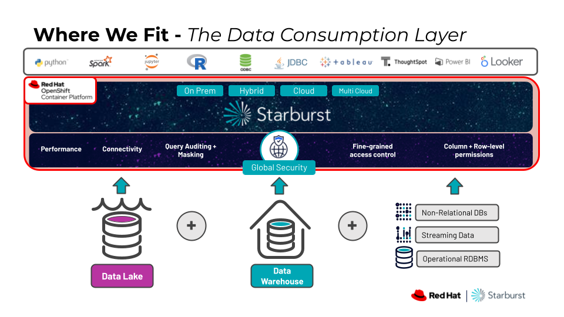
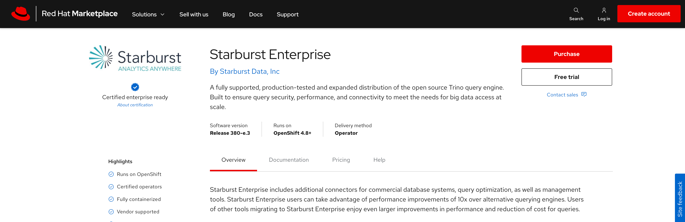
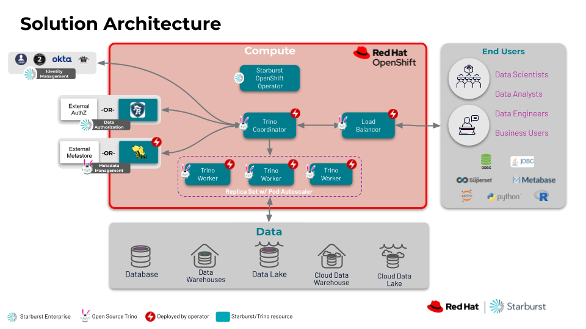

# What is Starburst?
Starburst is the enterprise offering of Trino, which is an open source, ANSI SQL MPP query engine.  With Starburst, users can quickly and easily query all of their data through a single point of access.  Through this single point of access, users can combine data from multiple sources in a single query no matter where there data lives (on-prem, hybrid, cloud, multi-cloud).  Additionally, Starburst delivers very fast performance against data lakes giving users the ability to query those sources using ANSI SQL without sacrificing performance.  As a result, users will be able to derive insights from all of their data faster than ever before because they no longer need to wait on data pipelines to consolidate all of the data into a single source.  

Check out this overview from YouTube for more info!

#
# Where does Starburst fit?
Starburst sits in between data consumers and all of the data they need to access.  Instead of connecting to each data source invidually or developing complex data pipelines to consolidate data into a single source, users connect directly to Starburst.  Starburst is built on the ANSI SQL standard, so users will be able to leverage their existing queries and tools when connecting Starburst.  Starburst will take care of securely reaching out to each data source and combining the data into a single result set so that users can focus on deriving insights and not spend their time trying to get access to the data they need.

#
# How is Starburst deployed?
Starburst has two main offerings:  Starburst Enterprise and Starburst Galaxy

Starburst Enterprise is the self-managed offering and supports on-prem, hybrid, cloud and multi-cloud deployments.  While it can be deployed on bare metal, customers typically deploy Starburst Enterprise in a Kubernetes environment.  Starburst Enterprise provides a Helm-based operator in the Red Hat Marketplace or can be deployed manually using Helm charts.

Starburst Galaxy is the fully managed offering and can be deployed in AWS, Azure and Google Cloud.  There is currently a RHODS add-on available for Starburst Galaxy.

Marketplace Listing:  https://marketplace.redhat.com/en-us/products/starburst-enterprise

#
# How are queries processed by Starburst?
1. Data consumers connect directly to Starburst with Tableau
2. Queries are sent to the Starburst coordinator node for processing.  
    - The queries is parsed to ensure it is syntactially correct.
    - Starburst's cost-based optimizer (CBO) uses statistics about the data to determine the most efficient way to process the query.
    - The CBO then breaks up the query into smaller, more efficient fragments.
3. The query fragments are then assigned to the worker nodes in the cluster.
    - The workers then process the query in parallel for optimal performance.
    - They securely reach out to each data source, pushing down any optimizations they can.
    - The data from each source is then read back into memory in parallel and is combined as needed to finish processing the query.
4. Once the workers are done processing the query, the final results are sent back to the coordinator.
5. The coordinator then streams the results back to user.

Thanks to Starburst’s ability to process the query in parallel, it’s able to return these results back to users in less time.

