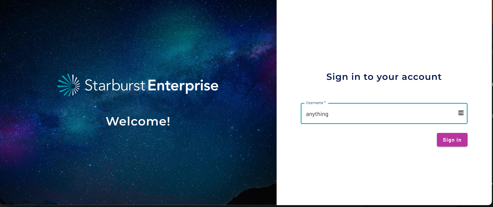
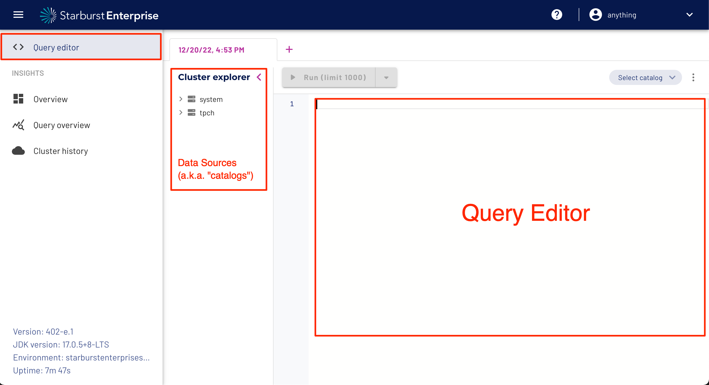
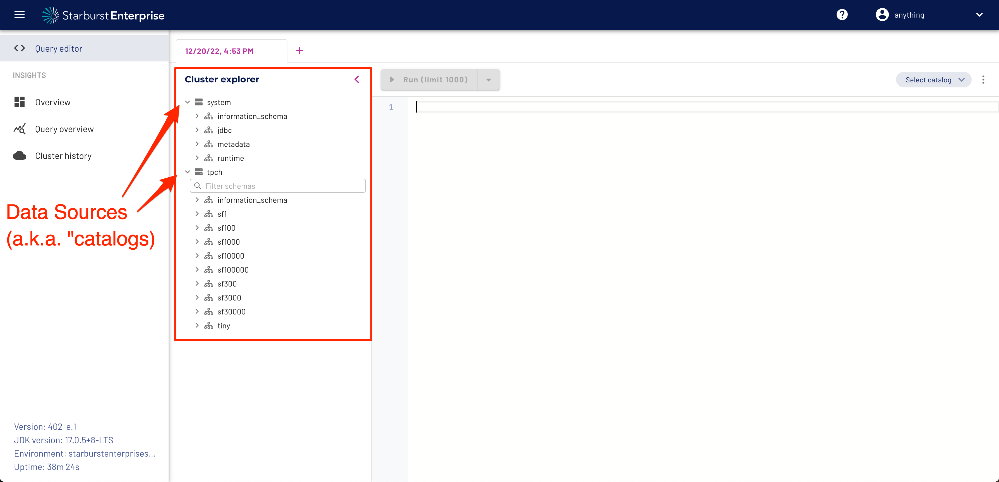
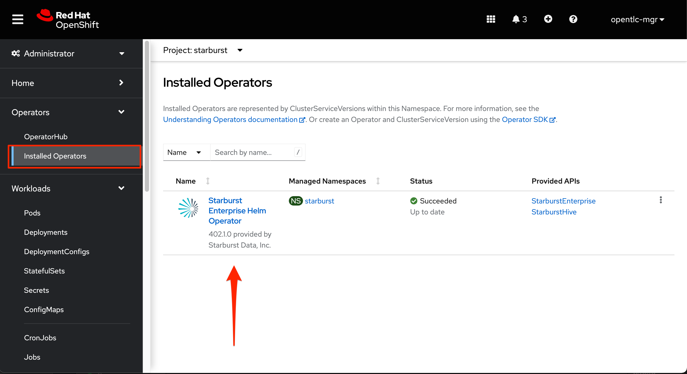
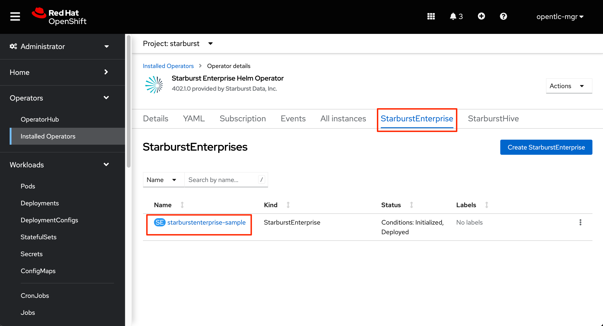
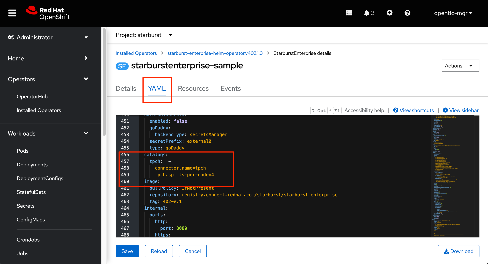
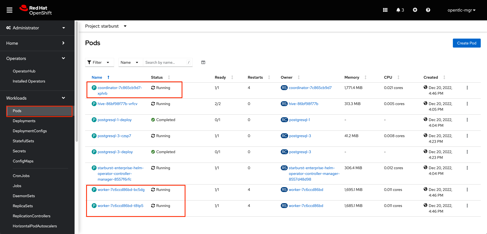
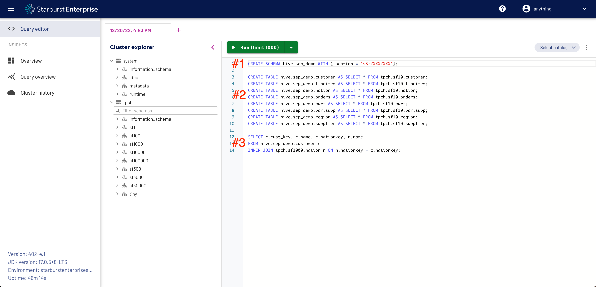

To get the most out of the environment that has been made available to you, we recommend following the steps below to finish preparing your environment so that you can deliver a more impressive demo.

#
# (1) Access Starburst Enterprise Web UI

The Starburst Enterprise web UI provides an easy way for you to monitor resource utilization (CPU & Memory) within your Starburst Enterprise cluster, track query history and execute SQL statements against your cluster. While Trino (the open source core Starburst Enterprise is built on) provides a similar web UI, the monitoring information it provides is limited and it does not allow you to navigate the catalogs (data sources) in your cluster or write SQL queries. Additionally, the Insights interface is more modern and shows better during demos.


After launching the RHPDS instance, a route will automatically be created for you that points to the Starburst service.  Click on the URL provided in the route to access the Starburst Enterprise web UI.


After clicking on the URL provided in the route, you should see the Starburst web UI login screen.  Authorization has not been enabled in this instance, so you can type any username to login.  



Once you are logged in, you should see the homescreen for the Starburst Enterprise web UI.  Information on navigating the Starburst Enterprise web UI can be found in [Starburst documentation](https://docs.starburst.io/latest/overview/sep-ui.html).


To see the data sources that are available in your Starburst cluster and to access the SQL editor for running queries with Starburst, go to the **Query Editor** tab.


#
# (2) Data Sources (a.k.a. "Catalogs")

*Catalogs* are the Starburst term for data sources. To see the catalogs that are available in your cluster and to run SQL statements against them, go to the **Query Editor** tab.  In this environment, you will see 2 catalogs already setup for you.  The “system” catalog stores system information and will not be needed for your demos. The “tpch” catalog contains TPCH benchmarking data that you can use for your demos (does not contain any sensitive information).



#
# (3) Add Additional Data Sources
Starburst Enterprise provides 40+ connectors so that customers can connect to almost any data source within their ecosystem.  The full list of connectors available can be found in the [Starburst Documentation](https://docs.starburst.io/latest/connector.html).  Depending on the needs of your customer/prospect, you may want to show Starburst Enterprise connecting to more data sources than just TPCH.  Additional data sources are not currently provided in this environment, but if you have set up a source you would like to connect to for your demo, you can do so as long as that source is reachable from the RHPDS environment.  The Hive metastore pod should already be running in your Starburst cluster, so you do not need to install that separately if you plan on using the Hive, Iceberg or Deltalake connectors.


To add a data source, go to the **Installed Operators** page in your OpenShift console and then click on the **Starburst Enterprise Helm Operator**.



Click on the **StarburstEnterprise** tab and then lick on **starburstenterprise-sample** to access the Starburst Enterprise resource.



On the **YAML** for the Starburst Enterprise resource, scroll down until you find the “catalogs” section. You should already see an entry for the “tpch” catalog. Follow the instructions in the [Starburst connector documentation](https://docs.starburst.io/latest/connector.html) to add the catalog for the source you would like to connect to.



After you have added the appropriate configuration lines to the YAML file, click on **Save**. This will automatically delete the existing Starburst Enterprise resources and create new ones for you with the new catalog(s) configured. Go to the **Pods** page in your OpenShift console to confirm that the Starburst Enterprise resources (1 coordinator and 2 worker pods) have come back online before trying to access the new catalogs through the Starburst Enterprise web UI.



#
# (4) Adding Data
If you already have data loaded somewhere that you would like to use for your demo, then you will be able to access that data through Starburst as soon as you add that data source to your Starburst cluster using the instructions in the previous section.  If you do not have any demo data available, then you can copy the TPCH data that is already in the instance into any data source you have added to your Starburst cluster that supports writes.  Below is an example of how to copy data from the TPCH data source to a Hive-based data source.


## EXAMPLE
From the **Query Editor** page in the Starburst Enterprise web UI, run the following SQL statements.  Following the screenshot is more information about each set of the SQL statements.



To copy data from the TPCH data source into a new data source, you first need to create a schema in the destination data source to store the data.  Below is an example of copying data from TPCH into an S3 bucket using Starburst's Hive connector.  The location you specify will correspond to the object storage location where the data will be written.  In this example, it is an S3 bucket.  Please note that the "WITH location" property is only required when using the Hive, Iceberg or Deltalake connectors.  For all other data sources, follow the standard procedures for creating a schema in that data source.
````
CREATE SCHEMA hive.sep_demo WITH (location = 's3:/XXX/XXX');
````


Now that the schema exists, you can start copying over the TPCH tables. Execute the SQL statements below from the **Query Editor** page in the Starburst Enterprise web UI to copy the tables.
````
CREATE TABLE hive.sep_demo.customer AS SELECT * FROM tpch.sf10.customer;
CREATE TABLE hive.sep_demo.lineitem AS SELECT * FROM tpch.sf10.lineitem;
CREATE TABLE hive.sep_demo.nation AS SELECT * FROM tpch.sf10.nation;
CREATE TABLE hive.sep_demo.orders AS SELECT * FROM tpch.sf10.orders;
CREATE TABLE hive.sep_demo.part AS SELECT * FROM tpch.sf10.part;
CREATE TABLE hive.sep_demo.partsupp AS SELECT * FROM tpch.sf10.partsupp;
CREATE TABLE hive.sep_demo.region AS SELECT * FROM tpch.sf10.region;
CREATE TABLE hive.sep_demo.supplier AS SELECT * FROM tpch.sf10.supplier;
````


You now have the same data in both the “hive” and “tpch” catalogs. To join data between the 2 catalogs, all you need to do is specify the schema and table name for each table in your FROM clause. An example query is shown below.  Please note that when running queries through Starburst, it is recommended to include the full path to the table (i.e. <catalog>.<schema>.<table>) so that you can query across catalogs.
````
SELECT c.cust_key, c.name, c.nationkey, n.name
FROM hive.sep_demo.customer c
INNER JOIN tpch.sf1000.nation n ON n.nationkey = c.nationkey;
````


