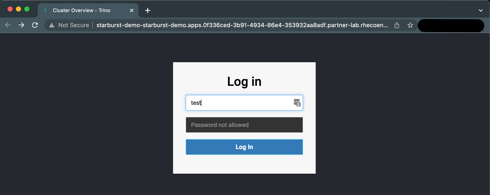
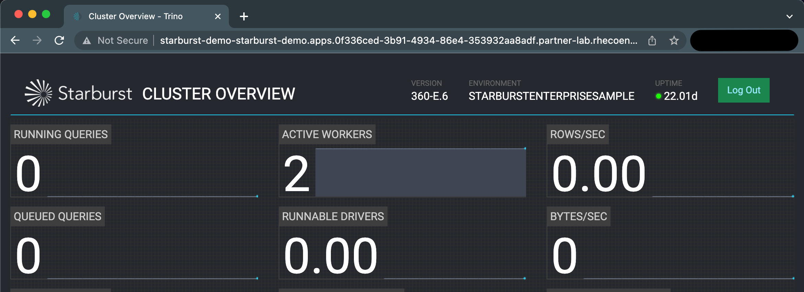
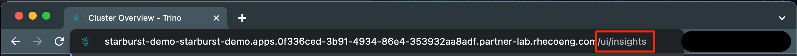
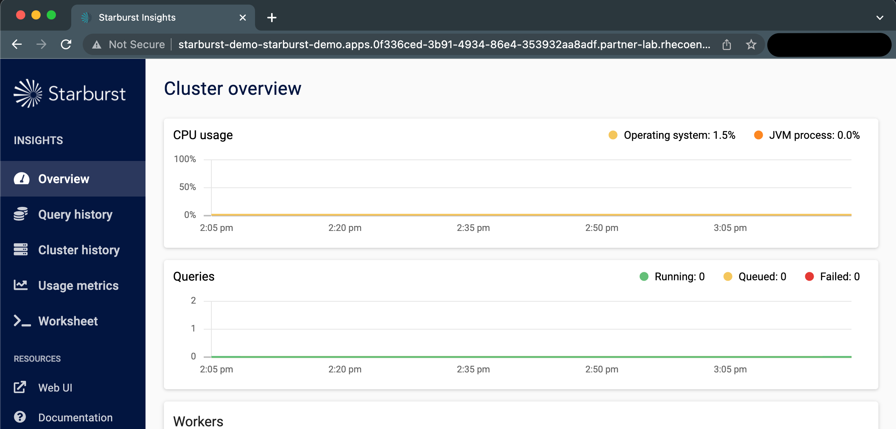
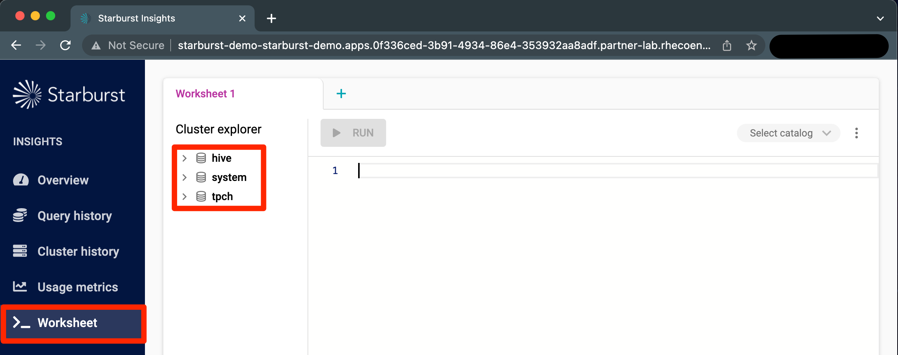
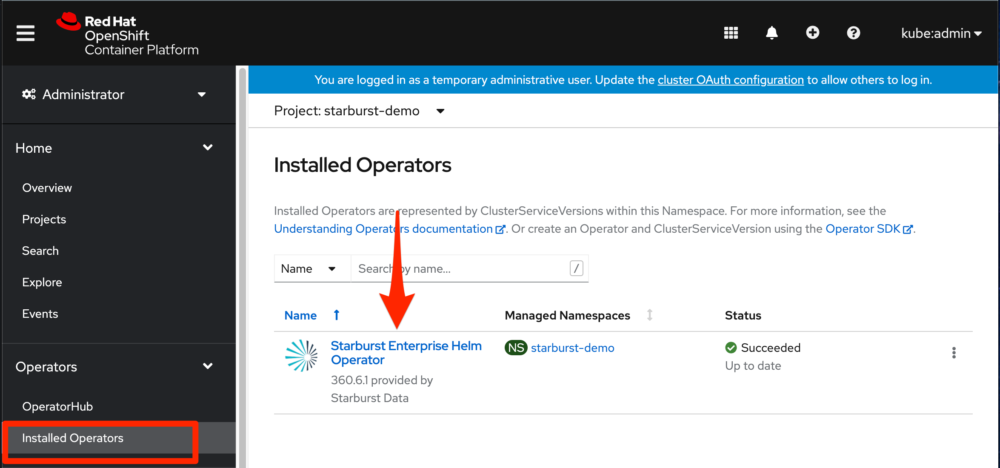
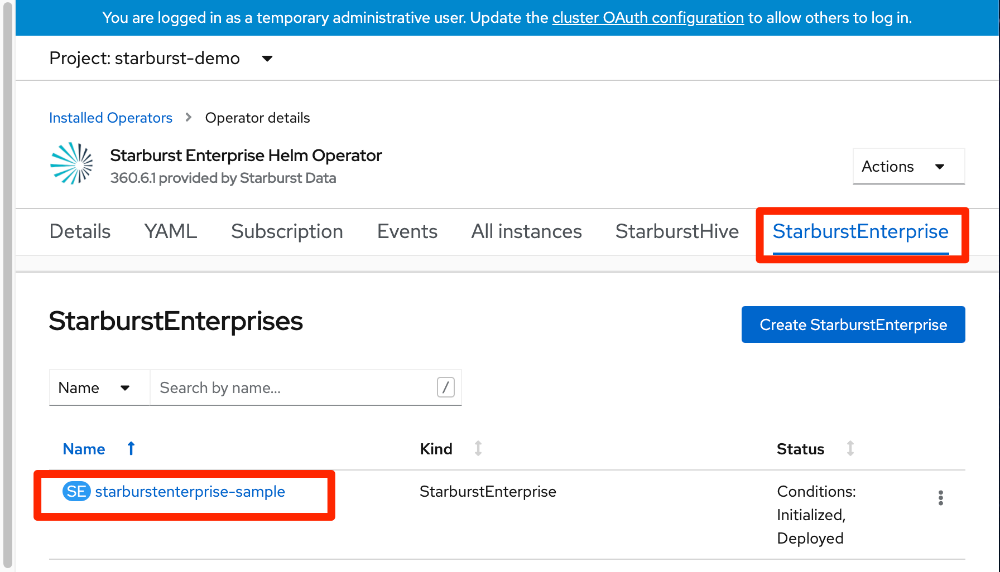
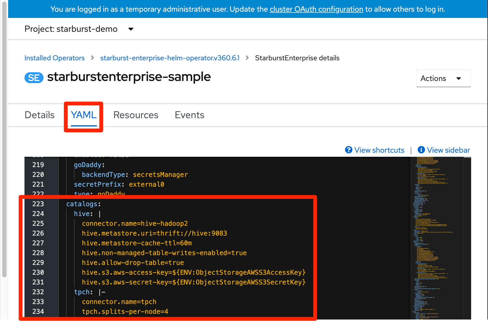
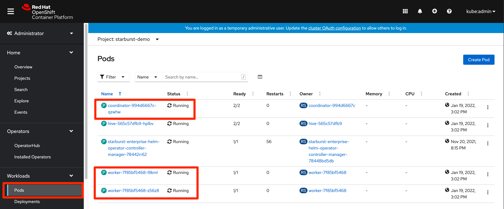

To get the most out of the environment that has been made available to you, we recommend following the steps below to finish preparing your environment so that you can deliver a more impressive demo.

# (1) Access Starburst Enterprise Web UI

The Starburst Enterprise web UI provides an easy way for you to monitor resource utilization (CPU & Memory) within your Starburst Enterprise cluster, track query history and execute SQL statements against your cluster. While Trino (the open source core Starburst Enterprise is built on) provides a similar web UI, the monitoring information it provides is limited and it does not allow you to navigate the catalogs (data sources) in your cluster or write SQL queries. Additionally, the Insights interface is more modern and shows better during demos.

By default, your environment will point you to the Trino web UI (shown below) when you click on the route that has been created in OpenShift.  To access the Starburst Enterprise web UI, first login with any userid of your choosing (no password required).  



Once you are logged in, you will see the interface pictured below (your version # and URL may be different).



To access the Starburst Enterprise web UI, append "insights" to the end of the Trino web UI URL (after /ui/) and hit ENTER.  You will then be redirected to the Starburst Enterprise web UI (second screenshot).  Information on navigating the Starburst Enterprise web UI can be found in the [Starburst documentation](https://docs.starburst.io/latest/overview/sep-ui.html).





#
# (2) Configure Hive-Based Catalog

*Catalogs* are the Starburst term for data sources. To see the catalogs that are available in your cluster and to run SQL statements against them, go to the **Worksheets** tab.  In this environment, you will see 3 catalogs already setup for you.  The “system” catalog stores system information and will not be needed for your demos. The “tpch” catalog contains TPCH benchmarking data that you can use for your demo. The “hive” catalog will initially be empty.



The “hive” catalog utilizes Starburst’s Hive connector, which allows you to connect to a variety of object stores (S3, Ceph, HDFS, ADLS, GCS, etc). In this environment, the “hive” catalog is connected to a Ceph storage account and allows you to write data into it from the “tpch” catalog so that you can demonstrate query federation in Starburst Enterprise.  To copy data into the “hive” catalog from the “tpch” catalog, first create a schema in the “hive” catalog to store the data by running the SQL statement below from the **Worksheet** page. The location you specify will correspond to the S3 bucket where the data will be written.

````
CREATE SCHEMA hive.sep_demo WITH (location = ‘s3:/XXX/XXX’);
````

Now that the schema exists, you can start copying over the TPCH tables. Execute the SQL statements below from the **Worksheet** page to copy the tables.

````
CREATE TABLE hive.sep_demo.customer AS SELECT * FROM tpch.sf10.customer;
CREATE TABLE hive.sep_demo.lineitem AS SELECT * FROM tpch.sf10.lineitem;
CREATE TABLE hive.sep_demo.nation AS SELECT * FROM tpch.sf10.nation;
CREATE TABLE hive.sep_demo.orders AS SELECT * FROM tpch.sf10.orders;
CREATE TABLE hive.sep_demo.part AS SELECT * FROM tpch.sf10.part;
CREATE TABLE hive.sep_demo.partsupp AS SELECT * FROM tpch.sf10.partsupp;
CREATE TABLE hive.sep_demo.region AS SELECT * FROM tpch.sf10.region;
CREATE TABLE hive.sep_demo.supplier AS SELECT * FROM tpch.sf10.supplier;
````

You now have the same data in both the “hive” and “tpch” catalogs. To join data between the 2 catalogs, all you need to do is specify the schema and table name for each table in your FROM clause. An example is shown below.

````
SELECT c.cust_key, c.name, c.nationkey, n.name
FROM hive.sep_demo.customer c
INNER JOIN tpch.sf1000.nation n ON n.nationkey = c.nationkey;
````

#
# (3) Add Additional Catalogs
Starburst Enterprise provides 40+ connectors so that customers can connect to almost any data source within their ecosystem.  The full list of connectors available can be found in the [Starburst Documentation](https://docs.starburst.io/latest/connector.html).  Depending on the needs of your customer/prospect, you may want to show Starburst Enterprise connecting to more data sources than just Hive/Ceph and TPCH.  Additional data sources are not currently provided in this environment, but if you have set up a source you would like to connect to for your demo, you can do so as long as that source is reachable from the RHPDS environment.

To add a data source, go to the **Installed Operators** page in your OpenShift console and then click on the **Starburst Enterprise Helm Operator**.



Click on the **StarburstEnterprise** tab and then lick on **starburstenterprise-sample** to access the Starburst Enterprise resource.



On the **YAML** for the Starburst Enterprise resource, scroll down until you find the “catalogs” section (starting around line #223). You should already see entries for the “hive” and “tpch” catalogs. Follow the instructions in the [Starburst connector documentation](https://docs.starburst.io/latest/connector.html) to add the catalog for the source you would like to connect to.



After you have added the appropriate configuration lines to the YAML file, click on **Save**. This will automatically delete the existing Starburst Enterprise resources and create new ones for you with the new catalog(s) configured. Go to the **Pods** page in your OpenShift console to confirm that the Starburst Enterprise resources (1 coordinator and 2 worker pods) have come back online before trying to access the new catalogs through the Starburst Enterprise web UI.


